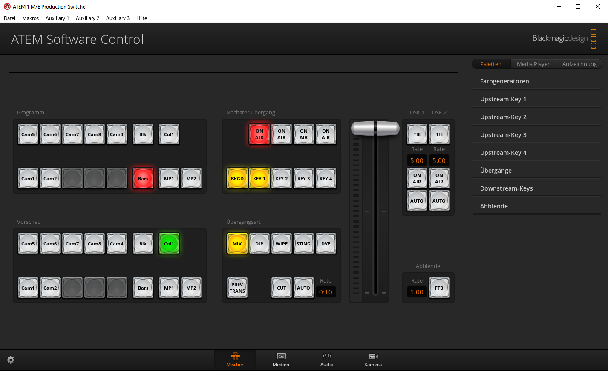

# bauchbinde

Bauchbinden-Generator für den Raspberry-Pi

## Installation

- Die Dateien aus `cgi-bin/` nach `/usr/lib/cgi-bin/` kopieren und .cgi-Dateien ausführbar machen.
- Die Dateien `www/` in den Webroot kopieren (normalerweise /var/www).

Zum Darstellen der Bauchbinde muss ein Browser im Fullscreen automatisch nach dem Login gestartet werden:

```
midori -e Fullscreen -a http://localhost/cgi-bin/showip.cgi
```

Für das LXDE gibt es eine Autostart-Datei (`autostart`), die man nach `/etc/xdg/lxsession/LXDE/autostart` kopieren kann.

Den HDMI-Ausgang des Raspberry-Pi mit einem HDMI-Eingang des ATEM-Mixers verbinden.

## Benutzung

Die IP-Adresse wird beim Start des Bauchbinden-Generators angezeigt.

Darstellung der Bauchbinde:

- http://{IP-Adresse des PI}/display.html

Editieren der Texte:

- http://{IP-Adresse des PI}/cgi-bin/edit.cgi

## In der ATEM Software-Control

- Mischer-Ansicht auswählen (die Ansicht mit dem dicken Regler)
- Rechts Paletten auswählen, Upstream-Key 1 auswählen



- Key auf Chroma einstellen
- Key-Quelle auf den HDMI-Eingang einstellen, an dem der Bauchbinden-Generator angeschlossen ist


Upstream-Key-Settings für Chroma-Key

- Mode: Chroma
- Mask: top: 9, bottom: -9, left: -16, right: 15.98
- Hue: 140 Grad
- Gain: 57 %
- Y Surpress: 52.1 %
- Lift: 16.2 %